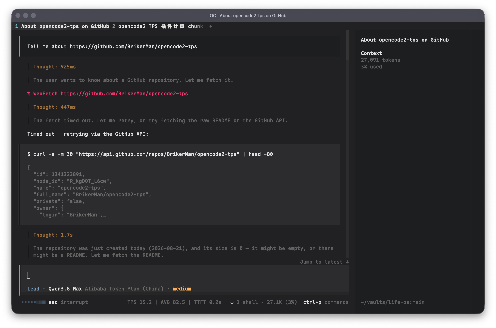

# opencode2-tps

Live LLM speed meter for the **OpenCode V2 TUI** — renders
`TPS 78.2 | AVG 75.4 | TTFT 0.4s` beside your prompt, so you always know
how fast the model behind your agent is actually streaming.



## Metrics

| Metric | Meaning | Source |
|--------|---------|--------|
| **TPS** | Live tokens/s over a 5s rolling window | Estimated from streaming text/reasoning growth — the protocol has no per-token counts mid-stream. CJK/fullwidth runes ≈ 1 token each, latin ≈ 4 chars/token. After the stream ends, the last live value **stays on screen** until the next stream replaces it |
| **AVG** | Session cumulative tokens/s | Real token counts from completed assistant messages (`message.tokens`) ÷ pure streaming time (first → last delta — tool execution time excluded) |
| **TTFT** | Time to first token of the latest message | Message start → first delta; shown live on first token, kept until the next message |

A multi-step response (text → tool call → text) accumulates: live TPS
freezes between steps, AVG keeps counting the whole turn.

## Install

One line:

```bash
curl -fsSL https://raw.githubusercontent.com/BrikerMan/opencode2-tps/main/install.sh | bash
```

The installer downloads the plugin and **merges** it into your existing
`~/.config/opencode/cli.json` — other plugins and settings are preserved
(a `.bak` backup is kept). Idempotent: safe to re-run.

GitHub raw unreachable? Point it at a mirror:

```bash
OPENCODE2_TPS_BASE=https://ghproxy.net/https://raw.githubusercontent.com/BrikerMan/opencode2-tps/main \
  curl -fsSL https://ghproxy.net/https://raw.githubusercontent.com/BrikerMan/opencode2-tps/main/install.sh | bash
```

### Manual install

```bash
mkdir -p ~/.config/opencode/plugins/tui
curl -fsSL https://raw.githubusercontent.com/BrikerMan/opencode2-tps/main/tui.js \
  -o ~/.config/opencode/plugins/tui/opencode2-tps.js
```

Then register it in `~/.config/opencode/cli.json` (use your absolute home
path — `~` is not expanded inside JSON):

```json
{
  "plugins": ["/Users/<you>/.config/opencode/plugins/tui/opencode2-tps.js"]
}
```

Restart the TUI. Newer V2 builds auto-discover `~/.config/opencode/plugins/tui/*`
and hot-reload on change (no restart needed).

**If the meter doesn't appear**, some builds need the peer deps present for
module resolution:

```bash
cd ~/.config/opencode && bun add solid-js @opentui/solid @opentui/core
```

## Slot placement

V2 betas differ in which slots they mount. The plugin claims several; the
host renders whichever exist:

- `prompt.footer.status` / `session_prompt_right` — beside the prompt (ideal)
- `session.header` — line above the transcript

## How it works

The host event emitter doesn't reach plugins on all V2 betas, so metrics are
driven reactively from the host data store: a Solid render effect reads the
session message list, and every streaming delta re-runs it. Runtime imports
go through the TUI host's runtime-module registry (`opentui:runtime-module:*`)
so plugin elements join the host's own render tree. On builds without that
registry the plugin stays silent instead of breaking the TUI.

## Compatibility

Early V2 betas (e.g. `next-16134`) load external TUI plugin modules but
cannot render UI from them (`No renderer found`). Upgrade to a newer V2
build to get the meter.

## License

[MIT](./LICENSE) © Eliyar Eziz
